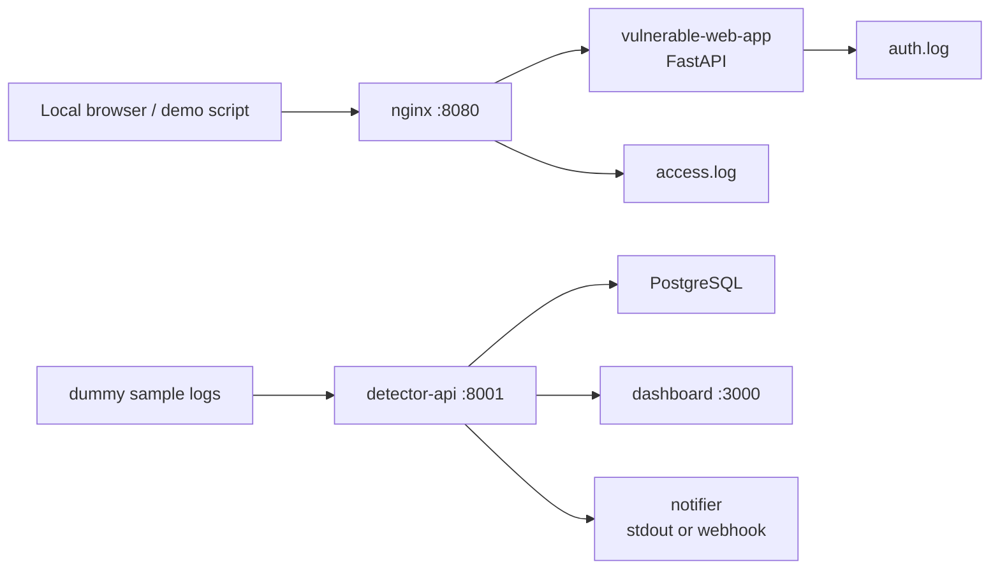

# mini-soc-siem-lab

## Project Overview

`mini-soc-siem-lab` is a small defensive SOC / SIEM-style lab for local log
analysis, attack-pattern detection, alert storage, visualization, and optional
notification. It collects Nginx-style access logs and authentication logs from a
Docker Compose lab, runs transparent detection rules, stores alerts in
PostgreSQL, and displays results in a React dashboard.

This project is designed for GitHub portfolio use, defensive learning, and local
validation. It does not include third-party scanning, unauthorized access
support, exploit automation, or real-world attack tooling.

## Motivation

セキュリティ診断やペネトレーションテスト支援の経験から、攻撃手法を理解するだけでなく、ログを分析し、疑わしい挙動を検知し、運用に活かす仕組みが重要だと考え、このプロジェクトを作成した。

The lab focuses on the defensive side of security work: turning application and
proxy logs into useful signals, explaining why an alert fired, and giving a
clear recommendation for the next response step.

## Architecture



Services:

- `vulnerable-web-app`: local-only FastAPI app that emits authentication logs.
- `nginx`: reverse proxy that writes JSON-like access logs.
- `detector-api`: FastAPI API for ingest, detection, alerts, and summary stats.
- `database`: PostgreSQL database with `events`, `auth_events`, `alerts`, and `detection_rules`.
- `dashboard`: React dashboard for alert triage and metrics.
- `notifier`: optional Discord or Slack webhook notifier with stdout fallback.

## Repository Structure

```text
mini-soc-siem-lab/
├─ README.md
├─ docker-compose.yml
├─ docs/
├─ backend/
│  ├─ detector_api/
│  └─ tests/
├─ vulnerable-web-app/
├─ nginx/
├─ dashboard/
├─ scripts/
└─ .github/workflows/ci.yml
```

## Features

- JSON log ingest for Nginx access events.
- JSON log ingest for authentication success and failure events.
- Detection rules for brute force, SQL Injection, XSS, path traversal,
  directory discovery, and suspicious User-Agent strings.
- Alert persistence with severity, evidence, recommendation, and status.
- Optional scheduled detection in `detector-api`.
- Dashboard summary with total events, High / Medium / Low counts, attack type
  counts, source IP ranking, and latest alerts.
- Optional Discord or Slack webhook notification.
- Docker Compose lab with all services.
- pytest coverage for the MVP rules and dashboard summary API.
- GitHub Actions for linting, tests, frontend build, and Compose validation.

## Detection Rules

| Detection | Severity | Default condition |
| --- | --- | --- |
| Brute force suspicion | High | Same IP has 10 or more failed logins within 5 minutes |
| SQL Injection suspicion | High | URL/query contains indicators such as `' OR '1'='1`, `UNION SELECT`, `--`, or `sqlmap` |
| XSS suspicion | Medium | URL/query contains indicators such as `<script>`, `onerror=`, or `javascript:` |
| Path traversal suspicion | High | URL contains `../`, encoded traversal, `/etc/passwd`, or similar sensitive paths |
| Directory discovery suspicion | Low | Same IP receives 20 or more 404 responses within 5 minutes |
| Suspicious User-Agent | Medium | User-Agent contains `sqlmap`, `nikto`, `nmap`, `masscan`, `gobuster`, `ffuf`, or similar |

Each alert includes a recommendation such as rate limiting login attempts,
enabling MFA, reviewing access logs, validating input, checking WAF rules, or
restricting access to admin paths.

## Tech Stack

- Python 3.11+
- FastAPI
- SQLAlchemy
- PostgreSQL
- React + Vite
- Docker Compose
- pytest
- ruff
- GitHub Actions

## Setup

Prerequisites:

- Docker and Docker Compose
- Python 3.11+ for local tests and scripts
- Node.js 20+ only if building the dashboard outside Docker
- VSCode is optional, but recommended for local development. See
  [docs/vscode-setup.md](docs/vscode-setup.md).

Create a local environment file:

```bash
cp .env.example .env
```

Start the lab:

```bash
docker compose up --build
```

Open:

- Web app through Nginx: http://localhost:8080
- Detector API: http://localhost:8001/docs
- Dashboard: http://localhost:3000

## Usage

Check service health:

```bash
curl http://localhost:8001/health
curl http://localhost:8080/health
```

Generate and ingest dummy sample logs:

```bash
python scripts/generate_sample_logs.py --send
```

Run detection manually:

```bash
curl -X POST http://localhost:8001/detect/run
```

When running through Docker Compose, scheduled detection is enabled by default.
After ingesting sample logs, wait up to `DETECTION_INTERVAL_SECONDS` seconds
and refresh the dashboard. Manual `/detect/run` is still useful when you want
immediate results.

View alerts:

```bash
curl http://localhost:8001/alerts
curl http://localhost:8001/stats/summary
curl http://localhost:8001/detect/scheduler
```

The dashboard at http://localhost:3000 refreshes automatically every 15 seconds.

Scheduled detection can be controlled with:

```env
DETECTION_SCHEDULER_ENABLED=true
DETECTION_INTERVAL_SECONDS=30
```

Set `DETECTION_SCHEDULER_ENABLED=false` if you want to keep detection fully
manual while debugging.

## Demo Commands

Generate local HTTP traffic against only the Docker Compose web app:

```bash
python scripts/send_demo_requests.py --base-url http://localhost:8080
python scripts/ingest_local_logs.py
```

This script refuses non-local targets. It is meant to create local Nginx and app
logs for inspection, not to test third-party systems. `ingest_local_logs.py`
reads the local Compose log files and submits them to the detector API. With the
scheduler enabled, alerts are created automatically shortly after ingest.

Write sample logs to a file:

```bash
python scripts/generate_sample_logs.py --output sample-data/demo-logs.json
```

Reset local demo database tables:

```bash
python scripts/reset_demo_data.py
```

Run tests:

```bash
pip install -r backend/requirements.txt
pytest
```

Build the frontend locally:

```bash
cd dashboard
npm install
npm run build
```

Validate Compose:

```bash
docker compose config
```

## API Examples

Ingest one Nginx event:

```bash
curl -X POST http://localhost:8001/ingest/nginx \
  -H "Content-Type: application/json" \
  -d '{"timestamp":"2026-01-01T00:00:00Z","ip":"192.0.2.10","method":"GET","path":"/search?q=%27%20OR%20%271%27%3D%271","status_code":200,"user_agent":"Mozilla/5.0"}'
```

Ingest one authentication failure:

```bash
curl -X POST http://localhost:8001/ingest/auth \
  -H "Content-Type: application/json" \
  -d '{"timestamp":"2026-01-01T00:00:01Z","ip":"198.51.100.10","username":"admin","success":false,"reason":"invalid_credentials"}'
```

Run rules:

```bash
curl -X POST http://localhost:8001/detect/run
```

Fetch one alert:

```bash
curl http://localhost:8001/alerts/1
```

## Screenshots

Add screenshots here after running the dashboard locally.

- `docs/screenshots/dashboard-summary.png`
- `docs/screenshots/latest-alerts.png`

## Security and Ethics

This repository is for defense, learning, and local validation only.

Do not use it to attack, scan, probe, or test third-party systems. Do not use it
to support unauthorized access. The demo scripts and sample logs are designed to
exercise detection rules inside this local Docker Compose lab only.

All sample data is synthetic. Use documentation IP ranges such as `192.0.2.0/24`,
`198.51.100.0/24`, and `203.0.113.0/24` for future examples.

## Phase Verification Checklist

### Phase 1: detector-api and database

Command:

```bash
docker compose up --build -d database detector-api
curl http://localhost:8001/health
```

Expected result: `detector-api` returns `{"status":"ok","service":"detector-api"}`.

### Phase 2: vulnerable-web-app, nginx, and ingest

Command:

```bash
docker compose up --build -d vulnerable-web-app nginx
curl http://localhost:8080/health
python scripts/generate_sample_logs.py --send
```

Expected result: the web app responds through Nginx, Nginx writes
`logs/nginx/access.log`, and the sample ingest command returns inserted IDs.

### Phase 3: detection engine

Command:

```bash
curl -X POST http://localhost:8001/detect/run
curl http://localhost:8001/alerts
```

Expected result: alerts include brute force, SQLi, XSS, path traversal, directory
scan, and suspicious User-Agent detections.

### Phase 4: alerts, stats, and notifier

Command:

```bash
curl http://localhost:8001/stats/summary
curl http://localhost:8001/detect/scheduler
docker compose logs notifier
```

Expected result: the summary contains counts and latest alerts, and scheduler
status shows whether automatic detection is enabled. If no webhook URL is
configured, the notifier prints alert messages to stdout.

### Phase 5: dashboard, tests, and CI

Command:

```bash
pytest
docker compose config
```

Expected result: tests pass, Compose validates, and the dashboard shows summary
cards plus the latest alert table.

## Future Work

- Suricata `eve.json` integration
- Sigma-style rule support
- AI-generated alert summaries
- HTML/PDF report generation
- WAF-style block mode for the local lab
- Gitleaks / Trivy integration
- OpenSearch / Grafana integration
