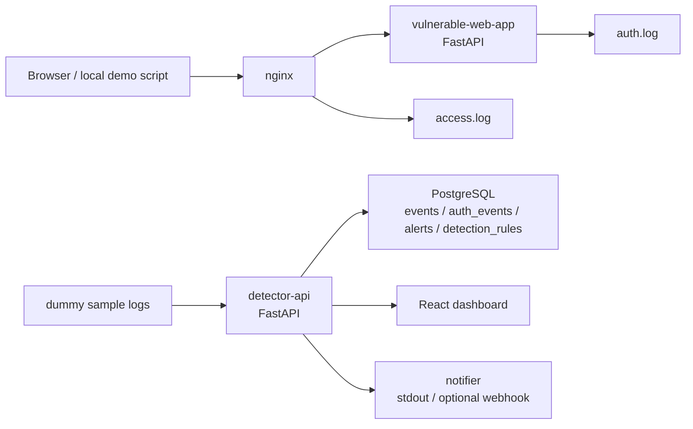

# Architecture

mini-soc-siem-lab is a local-only defensive lab. It collects dummy Nginx-style
access logs and authentication logs, stores normalized events in PostgreSQL, runs
simple detection rules, and exposes alerts to a React dashboard.



## Services

- `vulnerable-web-app`: local FastAPI app used only to emit predictable auth logs.
- `nginx`: reverse proxy that writes JSON-like access logs.
- `detector-api`: ingest, detection, alert retrieval, and dashboard summary API.
- `database`: PostgreSQL storage for events, alerts, and detection rules.
- `dashboard`: React UI for alert triage and summary views.
- `notifier`: optional Discord or Slack webhook sender; stdout fallback when unset.

## Data Flow

1. Local demo traffic hits `nginx` on `http://localhost:8080`.
2. `nginx` writes JSON-like access logs to `logs/nginx/access.log`.
3. The demo app writes authentication JSON lines to `logs/app/auth.log`.
4. Sample logs or local Compose log files can be sent to `detector-api` through
   `/ingest/nginx` and `/ingest/auth`.
5. `/detect/run` evaluates stored events against enabled rules.
6. Alerts are stored in PostgreSQL and shown by `/alerts` and `/stats/summary`.

## Phase Verification

### Phase 1

Command:

```bash
docker compose up --build -d database detector-api
curl http://localhost:8001/health
```

Expected result: the API returns `{"status":"ok","service":"detector-api"}`.

### Phase 2

Command:

```bash
docker compose up --build -d vulnerable-web-app nginx
curl http://localhost:8080/health
```

Expected result: the web app returns `{"status":"ok","service":"vulnerable-web-app"}` and
`logs/nginx/access.log` is created after requests.

### Phase 3

Command:

```bash
python scripts/generate_sample_logs.py --send
curl -X POST http://localhost:8001/detect/run
```

Expected result: created alerts include brute force, SQLi, XSS, path traversal,
directory scan, and suspicious user-agent detections.

### Phase 4

Command:

```bash
curl http://localhost:8001/alerts
curl http://localhost:8001/stats/summary
```

Expected result: alert records include `recommendation`, and the summary contains
severity counts, attack type counts, source IP ranking, and latest alerts.

### Phase 5

Command:

```bash
pytest
docker compose config
```

Expected result: tests pass and Docker Compose renders a valid config.
